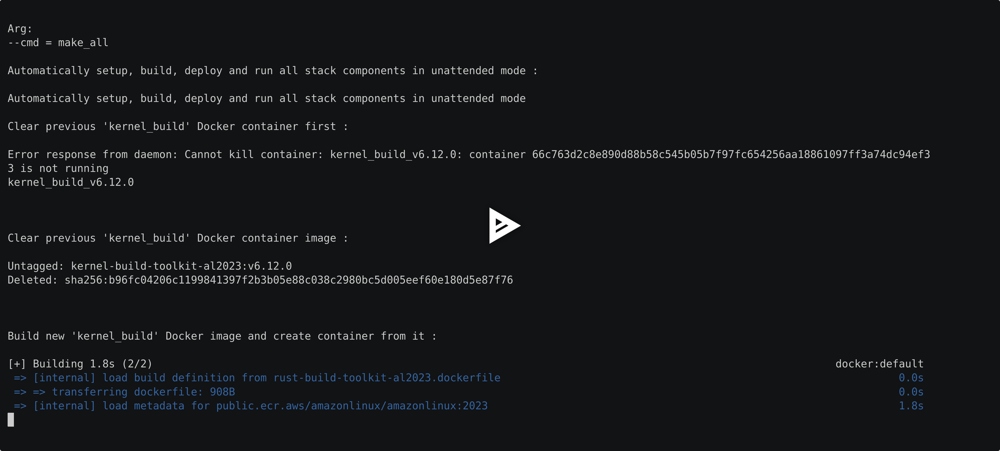
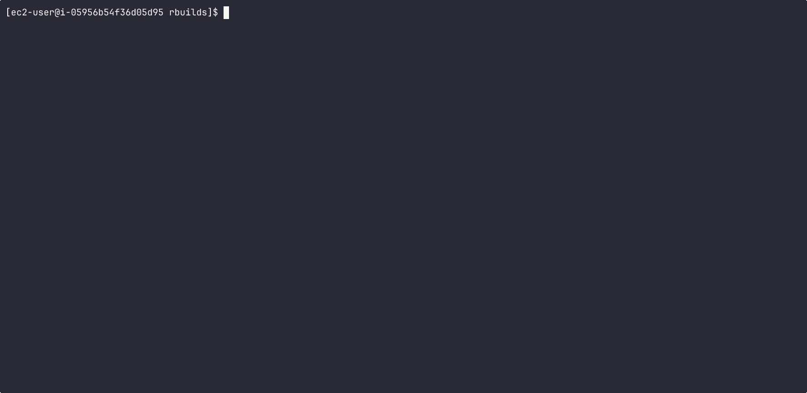
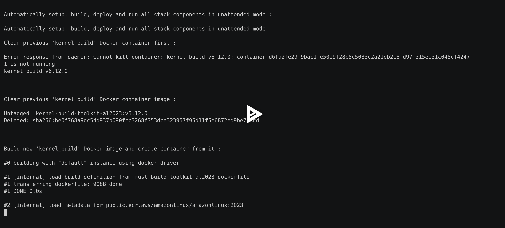

# Sentient Secure Enclaves Framework (Sentient Confidential Platform Framework) for Trusted Confidential AI & Crypto Apps

### The SSE Framework contains the following components:

## Pipeline SLC VSock Communication Protocol

Pipeline VSock secure local channel (SLC) communication protocol, implemented as a client-server application,
that provides remote control of enclave via running shell commands inside the enclave
and provides bidirectional files transmission into/from enclave's file system.

It implements binary protocol over VSock for local communication, which gives speed and user and developer experience with enclaves on par as Docker experience with containers.

## Encryption (WIP)

SSE Framework and specifically Pipeline SLC implementation supports strong P2P encryption and PRE multi-hop re-encryption, between host and enclave, enclave and S3 storage.

Encryption protocol implemented in Pipeline tool on a VSock buffer level and for content protection itself (data that transferred into and from enclave).

All the data outside the enclave are secured by strong encryption.

Pipeline supports SLC buffer level encryption for secure data transferring without leaks between enclave and host, and content encryption (encryption/decryption protocol and test tools) between host and outer storage (S3 at the moment), and multi-hop PRE re-encryption protocol and test tools for data protection between enclave and third-party systems during data transferring though many points in the cloud or for content protection between many participants/users in a network and on Sentient platform.

Keys are stored securely in a KMS service and locally can be stored in TPM devices (on EC2 instance).

## Transparent VSock Proxies

Transparent VSock Proxies supports port forwarding and NAT for inbound and outbound TCP streams, and include original destination address retrieving from TCP stream, with sending/receiving requests/responses to/from original destination address from request.

It gives full support of networking stack (securely, on demand, with kill-switch for sensitive computations during run-time) for enclaves and for higher level networking protocols over VSock (VirtIO VM sockets) for data exchange in forward and reverse proxy mode, with ports aggregation up to full-cone scheme support, via NetFilter rules for Linux kernel networking subsystem.

It is heavily relying on Linux networking stack and custom reproducible Linux kernel builds with networking stack support for enclaves.

## Web server for remote attestation inside the enclave (WIP)

Web server for remote attestation inside the enclave supports proofs generation and proofs verification, for content (external additional data, like model heavyweight tensor layers and data sets) placed in enclave run-time (in ramdisk or CoW disk image), signing and verifying of attestation documents (using KMS service from inside the enclave).

The attestation process guarantees that computation process on data, data producing or just data placing, was performed exactly inside the secure enclave's isolated environment, which prevent leakage of sensitive data and makes computational processes private and confident.

## Enclave's file system monitor (WIP)

Enclave's file system monitor (for ramdisk or CoW image) supports unconditional attestation for all outer external additional data that will be appeared in enclave file system and run-time.

It guarantees that all data, data producers and data handlers in enclave will be attested unconditionally.

This improves guarantees for computational processes and eliminate chances for data leaks and backdoors installation inside the enclave.

It integrated into web server and FS monitor maintains attestation documents database.

## Build system for enclave's reproducible builds

Build system for enclaves supports reproducibility of enclave's environment for application running in it, and guarantees reproducibility of building processes and final isolated enclave environment for apps, during enclave and application static build phase.

It can be embedded with integration machine (GitHub Actions, any other self-hosted or cloud CI) to perform continuous integration (CI) process for building and shipping apps and enclaves for them in DevOps pipelining enterprise software application environment and deployments.

Build system operates with custom but standard Unix/BSD and Linux tools, not relying on any third party or non-standard software.

Build system rebuild reproducibly custom Linux kernel for networking stack support, and rebuild reproducibly of custom Init system for running apps processes inside enclave and for KVM hypervisor interaction during enclave's boot process, during enclave's run-time and termination at the enclave's EOL.

### Reproducible builds demo:

### Enclave's networking demo:

## Visualization of SSE Framework infrastructure, components and its interaction:

### Whole Infrastructure bird-eye view:

### TEE Infrastructure:

### Topics:
- [#tee](https://github.com/topics/tee)
- [#trusted-execution-environment](https://github.com/topics/trusted-execution-environment)
- [#confidential-computing](https://github.com/topics/confidential-computing)
- [#confidential-ai](https://github.com/topics/confidential-ai)
- [#nitro-enclaves](https://github.com/topics/nitro-enclaves)
- [#nitro-enclave](https://github.com/topics/nitro-enclave)
- [#amd-sev-snp](https://github.com/topics/amd-sev-snp)
- [#intel-tdx](https://github.com/topics/intel-tdx)
- [#nvidia-tee](https://github.com/topics/nvidia-tee)
- [#nvidia-gpu-tee](https://github.com/topics/nvidia-gpu-tee)
- [#gpu-tee](https://github.com/topics/gpu-tee)

